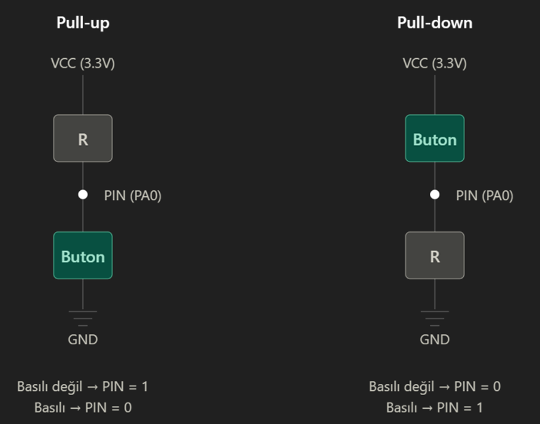

STM32_Embedded

STM32 ile yaptığım, gömülü yazılım tekniklerini öğrendiğim maker projelerimi paylaşıyorum.

#02Repo : Button_Polling

STM32CubeIDE'de buton sorgulaması yapmak için STM32F407-DISC1 üzerinden bare-metal kodlama yaptım. Buton (user button) basılı kaldığı sürece LED12 yanıyor. Aksi takdirde LED12 çalışmıyor.

KAVRAMSAL ŞEMA:

Bir buton, iki iletken pini birbirine bağlar veya birbirinden ayırır. Pinler birbirinden uzak olduğunda, hangi yükün 0 veya 1 olduğunu belirleyemezler. Bu nedenle, elektriksel gürültüden etkilenirler ve rastgele değerler alırlar. Bu duruma "floating pin" denir. Çözüm, pull-up veya pull-down dirençleri kullanmaktır. Bu sayede pinler varsayılan bir yüke sahip olabilir.

 

Pull_down: Düğmeye basıldığında pin her zaman 1 olur. Diğer tarafta ise pin 0 olur. STM32F407'de kullanıcı düğmesi için kullanılır.

Pull_up : Düğmeye basıldığında pin her zaman 0 olur. Diğer tarafta ise pin 1 olur.

EK BİLGİ:

Neden "int" yerine "uint32_t" kullanılır?

Çünkü "int"in kapasitesi sistem/platforma bağlıdır. Bu nedenle, int kullanmak güvenilir değildir. Ancak, uint32_t kullanılırsa bu kapasite miktarı değişmez. 32 bit olarak sabittir.

KNOW HOW
Butona(PA0) basılıp basılmadığını anlamak için while() içerisinde  if(*GPIOA_IDR & (1<<0)) kodu kullanıldı. if(*GPIOA_IDR==1) gibi bir değer kullanılmamasının sebebi GPIOA_IDR register'ının tek bir bit değil, 32 bitlik bir register olmasından kaynaklanır. Eğer PA0 yanıyorsa 32-bitlik register'ın değeri 1 olacaktır fakat aynı anda PA5'e de basılırsa bu durumda GPIOA_IDR register'ının toplam değeri değişir ve 1'den farklı bir hal alır (33 olur). == kullanma durumunda PA0 basılı olmasına rağmen kod bloğu false döner. Bu yüzden sadece istenen bloğun basılı olup olmadığını anlamak için & (1<<0) kullanılır.

